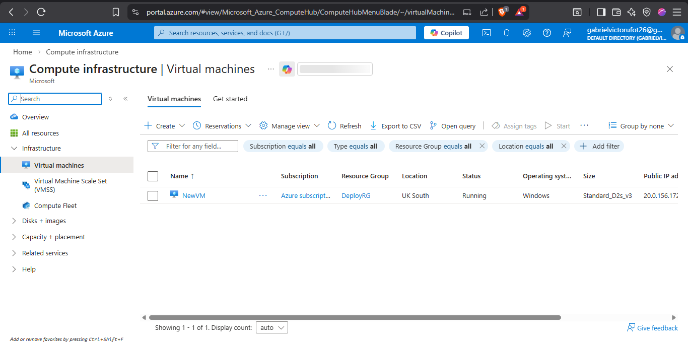
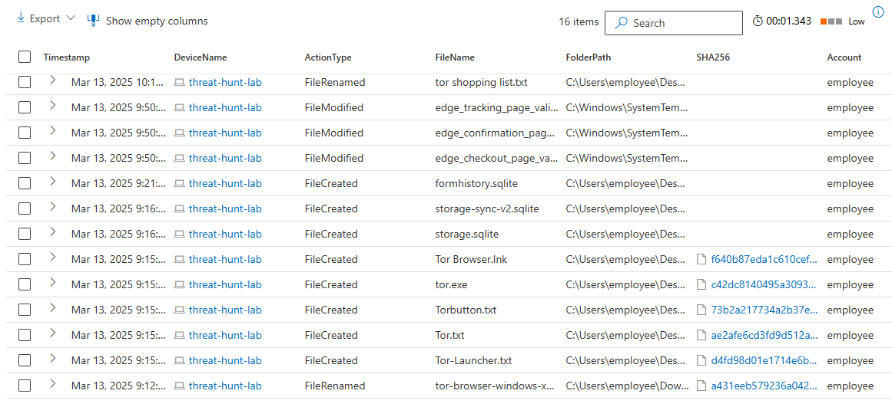
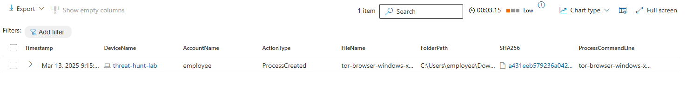
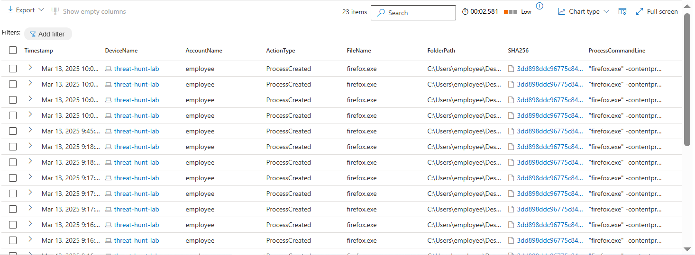
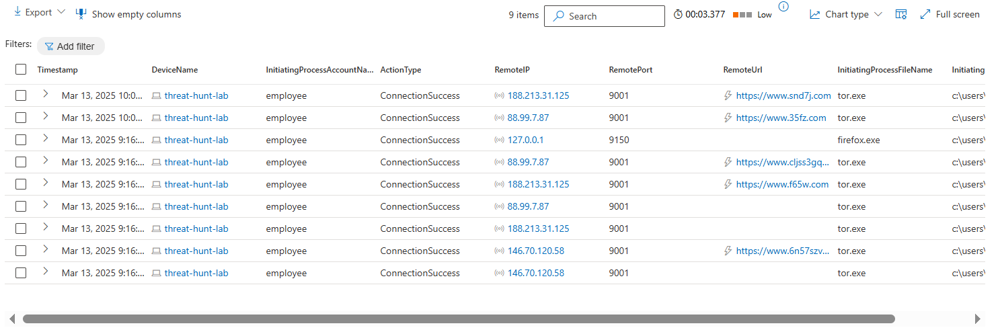

# Tor-threat-hunting-scenario
Threat Hunt Report: Unauthorized TOR Usage

## Platforms and Languages Leveraged
- Azure VM creation (corporate-style)
- Defender for Endpoint onboarding
- Baseline activity (normal user behavior)
- Threat simulation (TOR install & use)
- Threat hunting (KQL)
- Evidence correlation
- Response actions
- Final documentation

## Scenario
Management suspects that some employees may be using TOR browsers to bypass network security controls because recent network logs show unusual encrypted traffic patterns and connections to known TOR entry nodes. Additionally, there have been anonymous reports of employees discussing ways to access restricted sites during work hours. The goal is to detect any TOR usage and analyze related security incidents to mitigate potential risks. If any use of TOR is found, notify management.

## 1 Create the Azure Windows 11 VM
## Step 1: Create the VM
In Azure Portal:
- Go to Virtual Machines → Create
- Image: Windows 10 Enterprise
- Size: Any basic size (this is a workstation, not a server)
- Authentication: Username + password
    - Example:
    - Username: employee
    - Password: strong password


 
## Step 2: Networking
- Public IP: Enabled
- NSG: Default outbound allowed
- Inbound: Allow RDP (3389)

This mimics a corporate workstation with internet access.

## 2 Onboard the VM to Microsoft Defender for Endpoint
### Enable Defender
- Go to Microsoft Defender Portal
- Navigate to:
  Settings → Endpoints → Onboarding
- Choose:
  - OS: Windows 10
  - Deployment: Local script
- Download the onboarding script

### Run Onboarding Script
- RDP into the VM
- Open PowerShell as Administrator
- Run the onboarding script
- Wait 5–10 minutes

### Verify
In Defender Portal:
- Go to Assets → Devices
- Confirm:
  - Device name appears (e.g. threat-hunt-lab)
  - Status = Active
 


### Threat Hunting
Switch to Microsoft Defender → Advanced Hunting.

### Hunt 1: TOR Installer & Files
Searched for any file that had the string "tor" in it and discovered what looks like the user "employee" downloaded a TOR installer, did something that resulted in many TOR-related files being copied to the desktop, and the creation of a file called tor shopping list.txt on the desktop at 2025-03-13T07:11:20.5719934Z. These events began at 2025-03-13T06:12:03.9226543Z.

Query used to locate events:
```json
DeviceFileEvents
| where DeviceName == "threat-hunt-lab"
| where InitiatingProcessAccountName == "employee"
| where FileName contains "tor"
| order by Timestamp asc
```



### Hunt 2: TOR Installation Execution
Searched for any ProcessCommandLine that contained the string "tor-browser-windows-x86_64-portable-14.0.1.exe". Based on the logs returned, at 2025-03-13T06:15:01.5720012Z, an employee on the "threat-hunt-lab" device ran the file tor-browser-windows-x86_64-portable-14.0.1.exe from their Downloads folder, using a command that triggered a silent installation.

Query used to locate event:
```json
DeviceProcessEvents
| where DeviceName == "threat-hunt-lab"
| where ProcessCommandLine contains "tor-browser"
| project Timestamp, AccountName, FileName, FolderPath, ProcessCommandLine
```



### Hunt 3: TOR Browser Launch
Searched for any indication that user "employee" actually opened the TOR browser. There was evidence that they did open it at 2025-03-13T06:16:22.0107346Z. There were several other instances of firefox.exe (TOR) as well as tor.exe spawned afterwards.

Query used to locate events:
```json
DeviceProcessEvents  
| where DeviceName == "threat-hunt-lab"  
| where FileName has_any ("tor.exe", "firefox.exe", "tor-browser.exe")  
| project Timestamp, DeviceName, AccountName, ActionType, FileName, FolderPath, SHA256, ProcessCommandLine  
| order by Timestamp desc
```



### Hunt 4: TOR Network Activity
Searched for any indication the TOR browser was used to establish a connection using any of the known TOR ports. At 2025-03-13T06:16:39.7272164Z, an employee on the "threat-hunt-lab" device successfully established a connection to the remote IP address 188.213.31.125 on port 9001. The connection was initiated by the process tor.exe, located in the folder c:\users\employee\desktop\tor browser\browser\torbrowser\tor\tor.exe.

Query used to locate events:
```json
DeviceNetworkEvents
| where DeviceName == "threat-hunt-lab"
| where InitiatingProcessFileName == "tor.exe"
| where RemotePort in (9001, 9030, 9050, 9051, 9150)
| project Timestamp, RemoteIP, RemotePort, InitiatingProcessFolderPath
```



## Chronological Event Timeline

### 1. File Download - TOR Installer
Timestamp: 2025-03-13T06:12:03.9226543Z
Event: The user "employee" downloaded a file named tor-browser-windows-x86_64-portable-14.0.1.exe to the Downloads folder.
Action: File download detected.
File Path: C:\Users\employee\Downloads\tor-browser-windows-x86_64-portable-14.0.1.exe
### 2. Process Execution - TOR Browser Installation
Timestamp: 2025-03-13T06:15:01.5720012Z
Event: The user "employee" executed the file tor-browser-windows-x86_64-portable-14.0.1.exe in silent mode, initiating a background installation of the TOR Browser.
Action: Process creation detected.
Command: tor-browser-windows-x86_64-portable-14.0.1.exe /S
File Path: C:\Users\employee\Downloads\tor-browser-windows-x86_64-portable-14.0.1.exe
### 3. Process Execution - TOR Browser Launch
Timestamp: 2025-03-13T06:16:28.6633463Z
Event: User "employee" opened the TOR browser. Subsequent processes associated with TOR browser, such as firefox.exe and tor.exe, were also created, indicating that the browser launched successfully.
Action: Process creation of TOR browser-related executables detected.
File Path: C:\Users\employee\Desktop\Tor Browser\Browser\TorBrowser\Tor\tor.exe
### 4. Network Connection - TOR Network
Timestamp: 2025-03-13T06:16:39.7272164Z
Event: A network connection to IP 188.213.31.125 on port 9001 by user "employee" was established using tor.exe, confirming TOR browser network activity.
Action: Connection success.
Process: tor.exe
File Path: c:\users\employee\desktop\tor browser\browser\torbrowser\tor\tor.exe
### 5. Additional Network Connections - TOR Browser Activity
Timestamps:
2025-03-13T06:16:35.0791953Z - Connected to 146.70.120.58 on port 9001.
2025-03-13T06:16:50.9511617Z - Local connection to 127.0.0.1 on port 9150.
Event: Additional TOR network connections were established, indicating ongoing activity by user "employee" through the TOR browser.
Action: Multiple successful connections detected.
### 6. File Creation - TOR Shopping List
Timestamp: 2025-03-13T07:11:20.5719934Z
Event: The user "employee" created a file named tor shopping list.txt on the desktop, potentially indicating a list or notes related to their TOR browser activities.
Action: File creation detected.
File Path: C:\Users\employee\Desktop\tor shopping list.txt


## Isolate the Device
- Defender Portal → Device → Isolate
- Prevent further activity

## Notify Management
Document:
- User
- Device
- Timeline
- Risk summary
